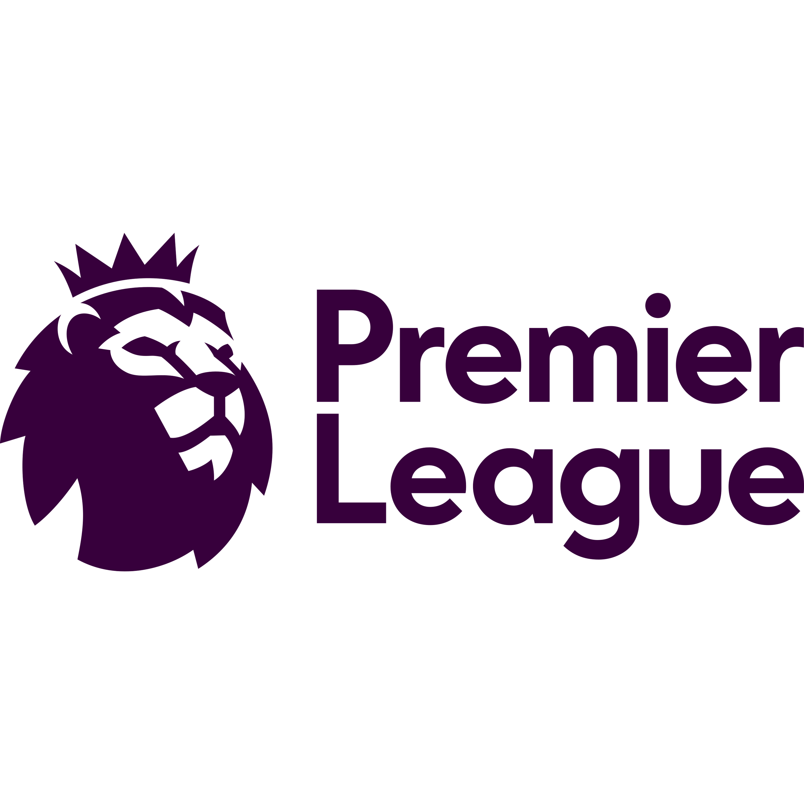

# Goat Tips - Frontend

<p align="center" style="display: flex; justify-content: center; align-items: center; gap: 40px;">
  
  
</p>


<p align="center">
  <strong>Predicoes orientadas por dados + leitura contextual com IA em tempo real.</strong><br/>
  Plataforma de analise para pre-jogo e ao vivo com foco em decisao objetiva.
</p>

---

Interface web do Goat Tips, plataforma de analise esportiva com previsoes pre-jogo/ao vivo, analytics e assistente Tipster IA.

## Identidade do Produto

Goat Tips nasce com uma proposta clara: transformar sinais complexos de jogo em decisao acionavel.
A experiencia combina:

- Modelo estatistico para previsibilidade de mercado.
- Camada narrativa para explicar risco, tendencia e contexto.
- Interface orientada a leitura rapida, sem perder profundidade analitica.

<p align="center">
  <em>Menos achismo. Mais contexto. Melhor decisao.</em>
</p>

## Visao Geral

Este projeto foi construido com Next.js (App Router) e React 19, com foco em:

- Visual premium com suporte completo a light/dark mode.
- Experiencia de dados em tempo real para partidas e mercados.
- Fluxo conversacional com IA na pagina de Tipster.
- Componentizacao e reutilizacao de UI para evolucao rapida.

## Contexto da Solucao

O produto foi desenhado para aumentar previsibilidade de decisoes esportivas combinando duas frentes:

- Predicoes estruturadas por evento (pre-jogo e ao vivo).
- Interpretacao conversacional por chat, para transformar dados em contexto acionavel.

Na pratica, a aplicacao nao entrega apenas um numero de probabilidade. Ela oferece:

- Leitura de cenario (forma, tendencia e sinais de risco).
- Narrativa explicavel para apoiar a decisao.
- Continuidade de contexto por sessao no Tipster IA.

## Como a Previsibilidade e Construida

### 1) Camada de Predicao

- As paginas de simulador, pre-jogo, ao vivo e partida consomem predicoes via hooks em hooks/.
- O frontend organiza e apresenta probabilidades, metricas e indicadores de risco em componentes especificos por dominio.
- TanStack Query controla cache, revalidacao e consistencia de dados para reduzir ruido de atualizacao.

### 2) Camada Conversacional (Tipster IA)

- O Tipster IA permite perguntas livres sobre jogos, mercados e tendencias.
- O estado da conversa e mantido em sessao via Zustand (store/use-chat-store.ts).
- O fluxo de pergunta/resposta e orquestrado por mutation em hooks/use-predictions.ts, com feedback de digitacao, historico e renderizacao de resposta rica.
- As respostas da IA chegam em formato narrativo para explicar o "por que" da predicao, nao so o "quanto".

### 3) Camada de UX para Decisao

- A interface foi pensada para reduzir friccao entre explorar dados e agir.
- O usuario consegue alternar entre cards objetivos (probabilidade, forma, mercado) e aprofundamento por chat sem trocar de produto.
- O resultado esperado e uma decisao mais consistente, com menor dependencia de intuicao isolada.

## Principais Funcionalidades

- Home com cards de partidas e destaques.
- Paginas de pre-jogo, ao vivo e simulador.
- Analytics com comparativos e metricas.
- Pagina de partida com analise detalhada.
- Tipster IA com chat contextual e hero animada.
- Navbar responsiva com transicoes e alternancia de tema.

## Stack Tecnica

- Next.js 16 (App Router)
- React 19 + TypeScript
- Tailwind CSS 4
- TanStack Query (cache e sincronizacao de dados)
- Zustand (estado local, incluindo sessao de chat)
- Framer Motion + GSAP + Three.js (animacoes e efeitos)
- next-themes (tema claro/escuro)

## Estrutura do Projeto

```text
app/                # Rotas e paginas (App Router)
components/         # Componentes de UI e blocos de features
hooks/              # Hooks de consulta e mutacao
providers/          # Providers globais (tema, query)
services/           # Camada de acesso a API
store/              # Stores Zustand
types/              # Tipagens compartilhadas
public/             # Assets estaticos
```

## Como Rodar Localmente

### 1) Instalar dependencias

```bash
npm install
```

### 2) Executar em desenvolvimento

```bash
npm run dev
```

Aplicacao disponivel em:

```text
http://localhost:3000
```

### 3) Build de producao

```bash
npm run build
npm run start
```

### 4) Lint

```bash
npm run lint
```

## Arquitetura e Convencoes

- Layout global em `app/layout.tsx` com:
  - `ThemeProvider`
  - `QueryProvider`
  - `Navbar`, `Footer` e `FloatingBot`
- Camada de servicos centraliza chamadas HTTP em `services/`.
- Hooks em `hooks/` encapsulam regras de dados para UI.
- Componentes mantem separacao por dominio (`home`, `analytics`, `partida`, `tipster`, `ui`).

## Fluxo de Dados (Resumo)

1. O usuario navega por uma rota de analise (pre-jogo, ao vivo, partida ou simulador).
2. O hook da feature consulta a camada de servicos.
3. A resposta e normalizada e exibida nos componentes de contexto e predicao.
4. No Tipster IA, a pergunta do usuario dispara uma mutation de narrativa/predicao.
5. A resposta da IA entra no historico da sessao e e exibida em formato conversacional.

## Tipografia e Design System

- Fonte de display: New Amsterdam.
- Fonte de texto: Noto Sans.
- Tokens visuais e temas definidos em `app/globals.css`.

## Status

Projeto em evolucao ativa, com foco em experiencia de produto, consistencia visual e performance perceptiva.
